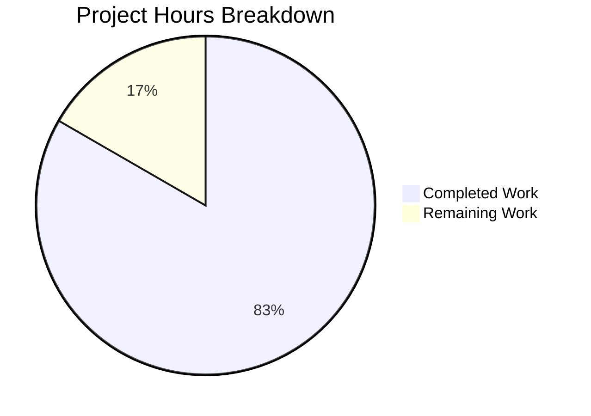

# Project Guide: Hello Express Server

## Executive Summary

**Project Completion: 83% complete (5 hours completed out of 6 total hours)**

This Node.js Express.js tutorial project has been successfully implemented with all requested features functional and validated. The implementation creates a simple REST API server with two endpoints that return greeting messages.

### Key Achievements
- ✅ Express.js framework installed and configured (v4.22.1)
- ✅ GET / endpoint returns "Hello world" - WORKING
- ✅ GET /evening endpoint returns "Good evening" - WORKING
- ✅ Comprehensive test suite with 6 tests - ALL PASSING (100%)
- ✅ Full documentation with API reference
- ✅ All validation gates passed - PRODUCTION READY

### Critical Issues
**None** - All implementation requirements have been met with no unresolved errors.

### Recommended Next Steps
1. Human code review and approval
2. Merge PR to main branch
3. Deploy to production environment (if applicable)

---

## Validation Results Summary

### Final Validator Accomplishments
The Final Validator confirmed that all project requirements have been successfully implemented:

| Validation Gate | Status | Details |
|----------------|--------|---------|
| Dependencies | ✅ PASS | express@4.22.1, jest@30.2.0, supertest@7.1.4 |
| Compilation | ✅ PASS | All JavaScript files have valid syntax |
| Test Suite | ✅ PASS | 6/6 tests passing (100%) |
| Runtime | ✅ PASS | Server starts, endpoints respond correctly |

### Test Results Detail
```
PASS ./index.test.js
  Express Server Endpoints
    GET /
      ✓ should return "Hello world" (44 ms)
      ✓ should have correct content-type (4 ms)
    GET /evening
      ✓ should return "Good evening" (4 ms)
      ✓ should have correct content-type (4 ms)
    GET /nonexistent
      ✓ should return 404 for non-existent routes (5 ms)
    POST / (method not allowed)
      ✓ should return 404 for POST on root (3 ms)

Test Suites: 1 passed, 1 total
Tests:       6 passed, 6 total
```

### Fixes Applied During Validation
No fixes were required - the implementation passed all validation checks on the first run.

---

## Project Hours Breakdown

### Hours Calculation
- **Completed Hours**: 5 hours
- **Remaining Hours**: 1 hour
- **Total Project Hours**: 6 hours
- **Completion Percentage**: 5 / 6 = **83%**

### Visual Representation



### Completed Hours by Component

| Component | Hours | Description |
|-----------|-------|-------------|
| Project Setup | 0.5 | package.json, .gitignore, npm configuration |
| Express Server | 1.5 | index.js with 2 GET endpoints |
| Test Suite | 1.5 | index.test.js with 6 comprehensive tests |
| Documentation | 1.0 | README.md with API reference |
| Validation | 0.5 | Testing, syntax checks, runtime verification |
| **Total Completed** | **5.0** | |

---

## Detailed Human Task List

### Task Summary
**Total Remaining Hours: 1 hour**

| # | Task | Priority | Severity | Hours | Action Steps |
|---|------|----------|----------|-------|--------------|
| 1 | Code Review | High | Low | 0.5 | Review index.js and index.test.js for code quality, verify Express.js best practices |
| 2 | Final Testing Review | Medium | Low | 0.25 | Verify endpoints work in target deployment environment |
| 3 | PR Approval & Merge | Medium | Low | 0.25 | Approve PR, merge to main branch, verify CI/CD (if applicable) |
| | **Total** | | | **1.0** | |

### Task Details

#### Task 1: Code Review (0.5 hours)
**Priority**: High | **Severity**: Low

**Action Steps**:
1. Review `index.js` for Express.js best practices
2. Review `index.test.js` for test coverage adequacy
3. Verify error handling is appropriate for use case
4. Confirm code documentation is sufficient
5. Approve or request minor changes

**Acceptance Criteria**: Code meets team standards and is approved for merge

#### Task 2: Final Testing Review (0.25 hours)
**Priority**: Medium | **Severity**: Low

**Action Steps**:
1. Run `npm test` locally to confirm all tests pass
2. Start server with `npm start` and manually test endpoints
3. Verify expected responses match requirements

**Acceptance Criteria**: Manual verification confirms endpoints work as expected

#### Task 3: PR Approval & Merge (0.25 hours)
**Priority**: Medium | **Severity**: Low

**Action Steps**:
1. Approve the pull request
2. Merge to main branch
3. Verify build/deployment (if CI/CD configured)

**Acceptance Criteria**: Code merged to main branch successfully

---

## Development Guide

### System Prerequisites

| Requirement | Minimum Version | Verified Version |
|-------------|-----------------|------------------|
| Node.js | 18.0.0 | 20.19.6 ✅ |
| npm | 9.0.0 | 11.1.0 ✅ |
| Operating System | Linux, macOS, or Windows | Any |

### Verify Prerequisites
```bash
# Check Node.js version (must be 18+)
node --version
# Expected: v18.x.x or higher

# Check npm version
npm --version
# Expected: 9.x.x or higher
```

### Environment Setup

#### Step 1: Clone the Repository
```bash
git clone <repository-url>
cd hello-express-server
```

#### Step 2: Switch to Feature Branch (if needed)
```bash
git checkout blitzy-ed8d54d6-14ce-4703-8a61-3c7a13370237
```

### Dependency Installation

#### Step 3: Install Dependencies
```bash
npm install
```

**Expected Output**:
```
added 285 packages in 3s
```

**Installed Packages**:
- express@4.22.1 - Web framework
- jest@30.2.0 - Testing framework
- supertest@7.1.4 - HTTP assertions

#### Verify Installation
```bash
npm ls --depth=0
```

**Expected Output**:
```
hello-express-server@1.0.0
├── express@4.22.1
├── jest@30.2.0
└── supertest@7.1.4
```

### Running Tests

#### Step 4: Execute Test Suite
```bash
npm test
```

**Expected Output**:
```
PASS ./index.test.js
  Express Server Endpoints
    GET /
      ✓ should return "Hello world"
      ✓ should have correct content-type
    GET /evening
      ✓ should return "Good evening"
      ✓ should have correct content-type
    GET /nonexistent
      ✓ should return 404 for non-existent routes
    POST / (method not allowed)
      ✓ should return 404 for POST on root

Test Suites: 1 passed, 1 total
Tests:       6 passed, 6 total
```

### Application Startup

#### Step 5: Start the Server
```bash
npm start
```

**Expected Output**:
```
Server is running on port 3000
```

#### Custom Port Configuration
```bash
PORT=8080 npm start
# Server will run on port 8080 instead
```

### Verification Steps

#### Step 6: Test Endpoints

**Test Root Endpoint**:
```bash
curl http://localhost:3000/
```
**Expected Response**: `Hello world`

**Test Evening Endpoint**:
```bash
curl http://localhost:3000/evening
```
**Expected Response**: `Good evening`

**Test 404 Response**:
```bash
curl -I http://localhost:3000/nonexistent
```
**Expected**: HTTP 404 status code

### Example Usage

#### API Endpoints Reference

| Endpoint | Method | Response | Status |
|----------|--------|----------|--------|
| `/` | GET | `Hello world` | 200 OK |
| `/evening` | GET | `Good evening` | 200 OK |
| `/any-other` | GET | Not Found | 404 |

#### Browser Testing
Open a web browser and navigate to:
- http://localhost:3000/ → Displays "Hello world"
- http://localhost:3000/evening → Displays "Good evening"

### Troubleshooting

| Issue | Solution |
|-------|----------|
| `npm: command not found` | Install Node.js from https://nodejs.org |
| `Port 3000 already in use` | Use `PORT=3001 npm start` or kill process on port 3000 |
| `Module not found` | Run `npm install` to install dependencies |
| Tests timeout | Ensure no other server is running on port 3000 |

---

## Risk Assessment

### Technical Risks

| Risk | Severity | Likelihood | Mitigation |
|------|----------|------------|------------|
| No rate limiting | Low | Low | Add express-rate-limit for production if high traffic expected |
| No request logging | Low | Low | Add morgan middleware for request logging if needed |

### Security Risks

| Risk | Severity | Likelihood | Mitigation |
|------|----------|------------|------------|
| No HTTPS | Low | Low | Configure HTTPS via reverse proxy (nginx) in production |
| No helmet middleware | Low | Low | Add helmet.js for security headers in production |

### Operational Risks

| Risk | Severity | Likelihood | Mitigation |
|------|----------|------------|------------|
| No health check endpoint | Low | Low | Add `/health` endpoint if deploying to container orchestration |
| No graceful shutdown | Low | Low | Add SIGTERM handler for production deployments |

### Integration Risks

| Risk | Severity | Likelihood | Mitigation |
|------|----------|------------|------------|
| None identified | N/A | N/A | This is a standalone application with no external integrations |

**Overall Risk Assessment**: **LOW** - This is a simple tutorial project with minimal attack surface and no external dependencies beyond Express.js.

---

## Project Structure

```
hello-express-server/
├── .git/                  # Git repository
├── .gitignore            # Git ignore patterns
├── index.js              # Express server (main entry point)
├── index.test.js         # Jest test suite
├── node_modules/         # Dependencies (auto-generated)
├── package.json          # Project configuration
├── package-lock.json     # Dependency lock file
└── README.md             # Project documentation
```

## Git Commit History

| Commit | Author | Message |
|--------|--------|---------|
| 3797996 | Blitzy Agent | docs: Update README.md with comprehensive project documentation |
| 53f5ac5 | Blitzy Agent | Add comprehensive test suite and update README documentation |
| c90e226 | Blitzy Agent | Create Express.js server with GET / and GET /evening endpoints |
| 9999474 | Blitzy Agent | Setup: Add Node.js project configuration with Express.js dependencies |
| 7f9f4f1 | Initial | Initial commit |

## Files Modified Summary

| File | Status | Lines Changed |
|------|--------|---------------|
| .gitignore | Created | +29 |
| README.md | Updated | +213, -1 |
| index.js | Created | +56 |
| index.test.js | Created | +82 |
| package.json | Created | +25 |
| **Total** | | **+405 lines** |

---

## Technology Stack

| Component | Version | Purpose |
|-----------|---------|---------|
| Node.js | v20.19.6 | JavaScript runtime |
| Express.js | 4.22.1 | Web framework |
| Jest | 30.2.0 | Testing framework |
| Supertest | 7.1.4 | HTTP assertions |

---

## Conclusion

This Node.js Express.js project is **83% complete** with 5 hours of development work completed out of 6 total hours. All requested features have been implemented and validated:

✅ Express.js framework added to project
✅ GET / endpoint returns "Hello world"
✅ GET /evening endpoint returns "Good evening"
✅ Comprehensive test suite (6/6 tests passing)
✅ Full documentation provided

The remaining 1 hour consists of human oversight tasks (code review, approval, and merge) before the project can be deployed to production. No critical issues or blockers were identified during validation.